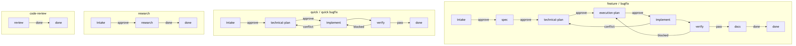

# Hyper

Hyper is a lightweight workflow for AI coding agents.

It ships two workflows for work that should not live inside one long prompt:

- **`hyper`** — **phased**:
  `intake -> spec -> technical-plan -> execution-plan -> implement -> verify -> docs -> done`.
  Approval gates at the points where direction matters.
- **`hyper-iterate`** — **adaptive**:
  `observe -> orient -> decide -> act`, repeated. One agreed plan up front,
  then bounded cycles that course-correct on real evidence. It can run with
  interactive approval gates or with explicitly delegated YOLO authority.

Both are delivered as [Agent Skills](https://agentskills.io): plain markdown
files an agent can load. There is no CLI, plugin, server, database, or hidden
state. Workflow state lives in `.hyper/` inside your project.

## When To Use Which

| Use **`hyper`** when                                       | Use **`hyper-iterate`** when                                          |
| ---------------------------------------------------------- | --------------------------------------------------------------------- |
| Destination and route are both stable up front             | Destination known, but the route must evolve through evidence         |
| Phased gates fit (spec, plan, build, verify)               | Goal still forming and needs probing before commitment                |
| Work does not need mid-flight re-routing                   | Reality is likely to reshape the plan once work starts                |
| You want every artifact (spec, plan, subtasks) on disk     | You want one persistent log of cycles, decisions, and route shifts    |
| Examples: feature, refactor, non-trivial bugfix            | Examples: investigation, prototype, tune-up, multi-session R&D        |

Skip both for tiny, obvious edits.

## Install

Clone this repo:

```bash
git clone https://github.com/ovidiugalatan/hyper7 ~/hyper7
```

From the cloned repo, install the skills:

```bash
bash ~/hyper7/.claude/skills/install-hyper/scripts/install.sh install
```

Manual install for Claude Code:

```bash
mkdir -p ~/.claude/skills
ln -s ~/hyper7/skills/* ~/.claude/skills/
```

**Deploy to all agents at once** (Claude Code, Codex, and `~/.agents`):

```bash
bash ~/hyper7e/hyper7E/scripts/deploy.sh
```

This removes any existing `hyper` / `hyper-*` symlinks from each agent directory and re-links all skill folders from the repo. Run it whenever you pull new skills or switch repos — new skills are picked up automatically.

Other agents can point at `skills/hyper/SKILL.md` or
`skills/hyper-iterate/SKILL.md` and use the matching workflow.

## Companion Skills

Hyper depends on a few external skills hosted at
[mattpocock/skills](https://github.com/mattpocock/skills). The most important
one for `hyper-iterate` is `grill-me`, which pressure-tests the loop plan and
each part plan before approval. Install those skills alongside Hyper if you
intend to use the adaptive workflow.

For delegated `hyper-iterate` runs, install a decision-proxy skill such as
`hyper-team` too. In YOLO mode, Hyper uses specialist agents for bounded
approval and route decisions instead of interrupting you for every gate.

## Workflow 1 — `hyper` (phased)

Use `hyper` when the cost of losing context is higher than the cost of a
little structure:

- features and large refactors
- non-trivial bug fixes
- investigations where you want findings recorded
- work touching auth, payments, migrations, deletes, or security boundaries
- anything you may pause, resume, or hand to another agent

### Lanes

Tracked lanes:

- `feature`: `intake -> spec -> technical-plan -> execution-plan -> implement -> verify -> docs -> done`
- `quick`: `intake -> technical-plan -> implement -> verify -> done`
- `research`: `intake -> research -> done`
- `code-review`: `review -> done`

`bugfix: true` is orthogonal:

- feature bugfix: `intake -> technical-plan -> execution-plan -> implement -> verify -> docs -> done`
- quick bugfix: `intake -> technical-plan -> implement -> verify -> done`

### Phases

| Phase             | Purpose                                                                                       | Main artifact                                       |
| ----------------- | --------------------------------------------------------------------------------------------- | --------------------------------------------------- |
| `intake`          | Capture and confirm the request, classify scope, detect bugfix intent.                        | `01-intake.md`                                      |
| `spec`            | Define what will change before technical design starts.                                       | `02-spec.md`                                        |
| `technical-plan`  | Decide how the change should be built in this codebase.                                       | `03-technical-plan.md`                              |
| `execution-plan`  | Turn the approved plan into worker-safe execution slices.                                     | `04-execution-plan.md` and subtask files            |
| `implement`       | Execute the approved slices.                                                                  | code changes and subtask completion records         |
| `verify`          | Run tests, review the diff, check accepted outcomes against real behavior.                    | `checks.md`                                         |
| `docs`            | Update human-facing docs when the change needs it.                                            | docs changes and a docs section in `checks.md`      |
| `research`        | Investigate a question and produce a recommendation with no code changes.                     | `research.md`                                       |

Approval gates happen after `intake`, `spec`, `technical-plan`,
`execution-plan`, and `research`.

### Example

```text
You: /hyper Add a login page with email and password, and keep the session after reload.
Agent: Wrote 01-intake.md. Review the framing and route.
You: approve
Agent: Wrote 02-spec.md. Approve to continue.
You: approve
Agent: Wrote 03-technical-plan.md. Approve to continue.
You: approve
Agent: Wrote 04-execution-plan.md and subtask files. Approve implementation.
You: approve
Agent: Implements, verifies, updates docs, and archives the finished task.
```

Resume later:

```text
/hyper T3
```

### YOLO mode

Invoke with a `yolo` prefix to run the task in delegated-authority mode:

```text
/hyper yolo Add a rate-limiting layer to the API endpoints.
```

In YOLO mode, `hyper` replaces routine approval gates with specialist proxy
decisions (via `hyper-team`) and suppresses low-value checkpoint prompts. The
task runs more autonomously; you are only interrupted for genuine blockers.

**What changes in YOLO mode:**

| Gate | YOLO behavior |
|------|---------------|
| `technical-plan` approval | Delegated to `hyper-team`. Consensus → auto-advance. No consensus → stops for you. |
| `execution-plan` approval | Same as `technical-plan`. |
| Implementation complete checkpoint | Suppressed. Advances to `verify` automatically. |
| Verify passed checkpoint | Suppressed. Advances to `docs` automatically. |
| Jira completion comment | Auto-posted without asking. |
| Jira description diff on resume | Auto-applied without asking. |
| Jira import dirty-tree (`--yolo` flag) | Auto-stashed without asking. |

**What always requires you:**

- `intake` and `spec` approval — these define your intent; a proxy cannot substitute.
- Verify failures (`needs-changes` or `blocked`) — remediation requires your judgment.
- Plan conflicts during implementation — same reason.
- `verify → docs` needs-changes path — you choose the next step.
- Proxy no-consensus — the proxy couldn't decide; it's your call.

**Prerequisites:** install `hyper-team` alongside Hyper. Without it, YOLO mode
cannot invoke a proxy and will stop at the first delegated gate.

**Jira import with YOLO:** pass `--yolo` to the import command to set YOLO mode
and apply delegated behavior during import:

```text
hyper-jira import PROJ-123 --yolo
```

### What it writes

```text
.hyper/tasks/T1-add-login-page/
  task.md
  dashboard.md
  01-intake.md
  02-spec.md
  03-technical-plan.md
  04-execution-plan.md
  05-execution-plan-review.md
  T1.1-add-login-tests.md
  T1.2-implement-login.md
  checks.md
  plan-conflict.md
  handoff.md
  retro.md
```

Most useful files:

- `task.md`: current phase and task metadata
- `dashboard.md`: computed human-readable task summary
- `01-intake.md` … `04-execution-plan.md`: the approved phase artifacts
- `checks.md`: test, review, QA, and docs results
- `plan-conflict.md`: written when implementation surfaces a design conflict
  and the task redirects back to `technical-plan`; carries the broken
  assumption, evidence, and revival signal so the design phase can revise
  against a concrete trigger

## Workflow 2 — `hyper-iterate` (adaptive)

Use `hyper-iterate` when the destination is known well enough to start but
the route must evolve through contact with reality, or when the goal itself
is still forming and needs probing before commitment:

- iterative work where each move feeds the next decision
- prototypes and throwaway probes before committing to a route
- multi-session investigations that need context to survive interrupts
- a big goal that should be split into adaptive parts, not a rigid plan
- anything where reality is likely to reshape the plan mid-flight

### Phases

| Phase                | Purpose                                                                                                                                              |
| -------------------- | ---------------------------------------------------------------------------------------------------------------------------------------------------- |
| `Load and Route`     | Resume the right loop or create a new one. Re-check project rules and capability bindings.                                                           |
| `Align`              | An alignment pass: restate the request, scan the codebase, agree the **loop plan** and current **part plan**, then pressure-test before user or delegated approval. |
| `Cycle`              | One coherent observe → orient → decide → act move at a time. Each cycle picks an intent and an evidence-backed next step.                            |
| `Verify and Close`   | Run tests, code review, docs check, and definition-of-done check. The loop flips to `done` only on a passing verify entry.                           |

Cycle intents: `probe`, `implement`, `validate`, `reroute`, `reframe`, `stop`.

Approval gates happen after the loop plan and after every new part plan. By
default those gates ask you. If you explicitly grant YOLO/delegated authority,
`hyper-iterate` records that authority in `loop.md` and uses specialist agents
to decide routine approvals and route choices inside the stated goal.

Delegated authority is bounded. Hyper still stops for you when the goal,
definition of done, or non-negotiables would change; when destructive actions,
security/privacy/legal risk, external side effects, or material cost appear;
when public behavior would change outside the approved goal; when a loop would
close without verify; or when proxy agents disagree.

### Example

```text
You: /hyper-iterate Investigate slow report generation and try a fix.
Agent: Created L3 — slow-report-investigation. Starting adaptive loop.
Agent: Loop plan — probe DB query plans first, then test caching vs. denormalization. Approve?
You: approve
Agent: Cycle 1 (probe). Captured slow EXPLAIN output. Learning: missing index on report_runs(user_id, created_at).
Agent: Cycle 2 (implement). Added the index. Evidence: 3.4s -> 180ms on hot path.
Agent: Cycle 3 (validate). Confirmed across three sample tenants. Next: close.
Agent: Verify pass. Closed L3.
```

Resume later:

```text
/hyper-iterate L3
```

### What it writes

```text
.hyper/loops/L3-slow-report-investigation/
  loop.md
  cycle1-explain-output.txt
  verify1-2026-05-14.txt
```

`loop.md` is the canonical state file. It carries goal, why, constraints,
definition of done, loop plan, current route, current focus, current bar,
parts, part alignment, evidence digest, cycles (append-only), verify entries
(append-only), and outcome. Optional evidence files (logs, diffs, screenshots)
live next to it and are referenced from `## Relevant artifacts`.

### Terminology

- **Loop** — the whole tracked unit of work, persisted in `.hyper/loops/L<N>-<slug>/`.
- **Loop plan** — the agreed top-level approach for the loop.
- **Part** — one bounded scope inside the loop. Numbered `P<N>`, append-only.
- **Part plan** — the agreed approach for one part.
- **Cycle** — one coherent observe-orient-decide-act move. Numbered `Cycle N`, append-only.
- **Verify entry** — one record of running the verify gate. Numbered `Verify N`, append-only.

## What `.hyper/` Looks Like

Both workflows share one project-local state directory:

```text
.hyper/
  tasks/         # hyper (phased) work
    T1-add-login-page/...
  loops/         # hyper-iterate (adaptive) work
    L3-slow-report-investigation/...
  archive/
  backlog.md
  epics.md
  jira.md
  memory.md
  repo.md
  rules.md
  recipes/
```

Add `.hyper/` to `.gitignore` unless you intentionally want to share task and
loop history.

## Useful Commands

User-facing skill names:

- `hyper`
- `hyper-iterate`
- `hyper-task`
- `hyper-backlog`
- `hyper-handoff`
- `hyper-retro`
- `hyper-code-review`
- `hyper-recipe`
- `hyper-iterate`
- `hyper-jira`
- `hyper-team`
- `hyper-short-story`
- `hyper-sync`


| Command | Use it for |
| --- | --- |
| `/hyper <request>` | Start structured work. |
| `/hyper T<N>` | Resume a task. |
| `/hyper-iterate <goal>`   | Start adaptive work.                                                    |
| `/hyper-iterate L<N>`     | Resume a loop.                                                          |
| `/hyper-task` | List, create, defer, cancel, or inspect tasks; manage epics. |
| `/hyper-backlog` | Add, list, promote, or drop future ideas. |
| `/hyper-handoff` | Write a handoff when conversation context would be lost. |
| `/hyper-retro` | Record lessons after a task or session. |
| `/hyper-code-review` | Review an arbitrary diff, branch, PR, or staged change. |
| `/hyper-recipe` | Manage reusable project-local procedures in `.hyper/recipes/`. |
| `/hyper-iterate` | Run an adaptive OODA-style loop in `.hyper/loops/` for goal-led work that should course-correct while it executes. It begins with understanding, code scan, findings, and an agreed plan, then moves part by part through the same approval gate. Long loops may use bounded delegated slices while one parent-owned loop stays authoritative. |
| `/hyper-jira` | Import a Jira issue by key, manage Jira status transitions, and post completion comments back to Jira. |
| `/hyper-team` | Ask another AI agent CLI for a second opinion. |
| `/hyper-sync` | Sync `.hyper/` with the shared team repo. Pull before starting a task, push after completing one. |
| `/hyper-short-story`      | Rewrite the previous response as a short, plain-language narrative.     |

Internal skills such as `hyper-intake`, `hyper-spec`,
`hyper-technical-plan`, `hyper-execution-plan`,
`hyper-execution-plan-review`, `hyper-research`, `hyper-implement`,
`hyper-worker`, `hyper-verify`, and `hyper-docs` are invoked by `hyper`; you
usually do not call them directly.

## Epics

Group related tasks under an epic. Epics are opt-in — they activate when
`.hyper/epics.md` exists. Without it, no epic behavior applies anywhere.

**Create an epic:**

```text
/hyper-task epic create User Authentication
→ Created E1 — User Authentication.
```

**Enroll an existing task in an epic:**

```text
/hyper-task epic add T3 E1
→ T3 enrolled in E1. Folder renamed to E1T3-add-login.
```

**Create a task pre-enrolled in an epic** (at creation time):

```text
/hyper Add JWT refresh token support --epic E1
→ Created E1T4 — Add JWT Refresh Token. Starting intake phase.
```

**List epics and their tasks:**

```text
/hyper-task epic list
→ E1 | User Authentication | active | T3, T4
   E2 | Dashboard Rebuild   | planned |
```

**List one epic:**

```text
/hyper-task epic list E1
→ E1 — User Authentication
   T3 — Add Login Page (verify)
   T4 — Add JWT Refresh (implement)
```

Task folders with an epic are named `E<N>T<M>-<slug>` (e.g. `E1T3-add-login`).
The `epic: E<N>` field in `task.md` is authoritative; `epics.md` Tasks column
is a convenience view recomputed by `epic list`.

## Team Sync

Share `.hyper/` state across a team so all developers see the same task list,
backlog, and context. Team sync is opt-in — activated by `.hyper/repo.md`.

**One-time setup (project lead):**

```text
/hyper-sync init git@github.com:myteam/project-hyper.git --branch my-app
→ Team sync initialized. Branch: my-app. Remote: git@github.com:myteam/project-hyper.git.
```

This writes `.hyper/repo.md` and does the initial push.

**New team member joining:**

```text
/hyper-sync clone git@github.com:myteam/project-hyper.git --branch my-app
→ Cloned my-app from git@github.com:myteam/project-hyper.git. Team sync ready.
```

**Daily workflow:**

```text
# Before starting work — pull latest team state
/hyper-sync pull
→ Pulled latest state from my-app.

# Start your task as normal
/hyper T7

# After finishing or archiving a task — push to share
/hyper-sync push
→ Pushed .hyper/ state to my-app.
```

**Check sync status:**

```text
/hyper-sync status
→ Branch: my-app. Ahead: 2, Behind: 0. Last commit: "hyper state update"
```

`hyper` also reminds you to pull before creating a task and push after
archiving, when `repo.md` is present.

Architecture: each project uses its own branch in the shared repo, so multiple
projects can share one repo without merge conflicts.

## Jira Integration

Import Jira issues directly into Hyper tasks. The integration is opt-in —
activated by `.hyper/jira.md`. Without it, no Jira behavior applies anywhere.
Credentials are never stored in `.hyper/`; `jira.md` is safe to commit.

### Setup

**MCP mode** (default — requires Jira MCP server installed in your agent):

```text
/hyper-jira init https://myorg.atlassian.net --project PROJ
→ Jira integration initialized. mode: mcp. base_url: https://myorg.atlassian.net. Project: PROJ.
```

**Docker mode** (direct REST API to a local/Docker Jira instance):

```text
/hyper-jira init http://localhost:8080 --project PROJ --mode docker --docker-url http://localhost:8090
→ Jira integration initialized. mode: docker. base_url: http://localhost:8080. Project: PROJ.
```

In docker mode, set credentials in your shell (never in any tracked file):

```bash
export JIRA_USER=yourname@org.com
export JIRA_TOKEN=your-api-token
```

**Check connectivity:**

```text
/hyper-jira status
→ Jira connected. mode: mcp. base_url: https://myorg.atlassian.net. Project: PROJ.
```

### Import a Jira issue

```text
/hyper-jira PROJ-123
→ Fetches summary, description, acceptance criteria, issue type, epic link,
  reporter, and all comments from Jira.
→ Maps issue type: Story → scope: feature, bugfix: false
→ Finds epic PROJ-42 in epics.md Source column → reuses E1
→ Creates T5-proj-123-add-login/task.md with jira_key: PROJ-123
→ Transitions PROJ-123 → "In Progress" in Jira
→ "Created T5 — Add Login (from PROJ-123). Continue with: hyper T5"
```

Issue type routing:

| Jira type | Hyper scope | bugfix |
|-----------|-------------|--------|
| Bug, Defect, Incident | feature | true |
| Story, Task, Feature | feature | false |
| Research, Spike | research | false |
| Epic | error — use `hyper-task epic create` | — |

Folder name always embeds the Jira key: `T5-proj-123-add-login` or
`E1T5-proj-123-add-login` when enrolled in an epic.

### Resume — automatic Jira sync

Every time you resume a Jira-linked task, `hyper` re-fetches the Jira issue:

```text
/hyper T5
→ Re-fetches PROJ-123 description + acceptance criteria
→ Shows diff if Jira spec changed since last sync (asks whether to update task.md)
→ Shows any new Jira comments since last sync (labeled "New since last sync")
→ Updates jira_synced_at in task.md
→ Continues to current phase
```

### Post a comment to Jira mid-work

```text
/hyper-jira comment "Decided on RSA-256 for JWT signing — better key rotation story."
→ Comment posted to PROJ-123.
```

### Archive — completion comment + status transition

When a task completes and `hyper` archives it:

```text
[Task reaches done →]
→ hyper generates jira.md with:
   - What was done (2–4 sentence summary)
   - Key decisions (from dashboard Decisions log)
   - Notes for QA (if any)
→ Shows jira.md, asks: "Post this comment to PROJ-123? [y/N]"
→ [y] Posts comment to PROJ-123
→ Transitions PROJ-123 → "QA Test" (or custom done_transition from jira.md)
→ Archives task folder to .hyper/archive/
```

The `done_transition` value is configurable per project in `.hyper/jira.md`.

## Working On Hyper

If you are editing this repo rather than using Hyper in another project:

- `AGENTS.md` contains the rules for contributors and agents editing Hyper.
- [`docs/maintaining-hyper.md`](docs/maintaining-hyper.md) describes the
  maintenance checks and fragile contracts to watch.
- `node scripts/validate-hyper.mjs` runs a lightweight structural validation
  of the skill suite.

## Design Choices

Hyper stays intentionally small:

- Markdown files are the state.
- The agent reads and writes those files directly.
- Approval gates happen after the artifacts that set direction.
- Verification is part of the workflow, not an optional afterthought.
- Two workflow shapes for two shapes of work — phased when direction is clear
  up front, adaptive when it has to evolve.
- Large work gets structure; tiny work should stay tiny.

## Hyper presentation

https://adrianf-gamelounge.github.io/hyper7E/

https://adrianf-gamelounge.github.io/hyper7E/hyper7-presentation.html

## Workflow Flow

```mermaid
flowchart TD
    subgraph feature ["feature / bugfix"]
        direction LR
        I1["intake"] -->|"approve"| S1["spec"]
        S1 -->|"approve"| TP1["technical-plan"]
        TP1 -->|"approve"| EP1["execution-plan"]
        EP1 -->|"approve"| IM1["implement"]
        IM1 --> V1["verify"]
        V1 -->|"pass"| D1["docs"]
        V1 -->|"blocked"| EP1
        IM1 -->|"conflict"| TP1
        D1 -->|"done"| DN1["done"]
    end

    subgraph quick ["quick / quick bugfix"]
        direction LR
        I2["intake"] -->|"approve"| TP2["technical-plan"]
        TP2 -->|"approve"| IM2["implement"]
        IM2 --> V2["verify"]
        V2 -->|"pass"| DN2["done"]
        V2 -->|"blocked"| IM2
        IM2 -->|"conflict"| TP2
    end

    subgraph research ["research"]
        direction LR
        I3["intake"] -->|"approve"| R3["research"]
        R3 -->|"done"| DN3["done"]
    end

    subgraph review ["code-review"]
        direction LR
        RV["review"] -->|"done"| DN4["done"]
    end
```



See [schema.md](schema.md) for the full state model and file layout.


