# Hyper

Hyper is a lightweight workflow for AI coding agents.

It gives the agent a durable process for work that should not live inside one
long prompt:

```text
intake -> spec -> technical-plan -> execution-plan -> implement -> verify -> docs -> done
```

Hyper is delivered as [Agent Skills](https://agentskills.io): plain markdown
files an agent can load. There is no CLI, plugin, server, database, or hidden
state. Workflow state lives in `.hyper/` inside your project.

You normally start with one skill: **`hyper`**.

## When To Use Hyper

Use Hyper when the cost of losing context is higher than the cost of a little
structure:

- features and large refactors
- non-trivial bug fixes
- investigations where you want findings recorded
- work touching auth, payments, migrations, deletes, or security boundaries
- anything you may pause, resume, or hand to another agent

Skip Hyper for tiny, obvious edits.

For tracked adaptive work where the destination is known or can be stated but
the route should evolve through live feedback instead of a full phase workflow,
use `hyper-iterate`. It starts with an interview-style alignment pass: state
your understanding, scan the codebase, report what already exists, agree the
big plan, then implement part by part with approval gates.

## Install

Clone this repo:

```bash
git clone https://github.com/ovidiugalatan/hyper7 ~/hyper7
```

From the cloned repo, install the skills:

```bash
bash ~/hyper7/.claude/skills/install-hyper/scripts/install.sh install
```

Manual install for Claude Code:

```bash
mkdir -p ~/.claude/skills
ln -s ~/hyper7/skills/* ~/.claude/skills/
```

Other agents can point at `skills/hyper/SKILL.md` and use Hyper for structured
development work.

## Basic Use

Start a task with `/hyper`:

```text
You: /hyper Add a login page with email and password, and keep the session after reload.
Agent: Wrote 01-intake.md. Review the framing and route.
You: approve
Agent: Wrote 02-spec.md. Approve to continue.
You: approve
Agent: Wrote 03-technical-plan.md. Approve to continue.
You: approve
Agent: Wrote 04-execution-plan.md and subtask files. Approve implementation.
You: approve
Agent: Implements, verifies, updates docs, and archives the finished task.
```

To resume later:

```text
/hyper T3
```

To resume adaptive work later:

```text
/hyper-iterate L3
```

## Workflow Lanes

Tracked lanes:

- `feature`: `intake -> spec -> technical-plan -> execution-plan -> implement -> verify -> docs -> done`
- `quick`: `intake -> technical-plan -> implement -> verify -> done`
- `research`: `intake -> research -> done`
- `code-review`: `review -> done`

`bugfix: true` is orthogonal:

- feature bugfix: `intake -> technical-plan -> execution-plan -> implement -> verify -> docs -> done`
- quick bugfix: `intake -> technical-plan -> implement -> verify -> done`

## What The Phases Mean

| Phase | Purpose | Main artifact |
| --- | --- | --- |
| `intake` | Capture and confirm the request, classify scope, and detect bugfix intent. | `01-intake.md` |
| `spec` | Define what will change before technical design starts. | `02-spec.md` |
| `technical-plan` | Decide how the change should be built in this codebase. | `03-technical-plan.md` |
| `execution-plan` | Turn the approved plan into worker-safe execution slices. | `04-execution-plan.md` and subtask files |
| `implement` | Execute the approved slices. | code changes and subtask completion records |
| `verify` | Run tests, review the diff, and check accepted outcomes against real behavior. | `checks.md` |
| `docs` | Update human-facing docs when the change needs it. | docs changes and a docs section in `checks.md` |
| `research` | Investigate a question and produce a recommendation with no code changes. | `research.md` |

Approval gates happen where direction matters:

- after `intake`
- after `spec`
- after `technical-plan`
- after `execution-plan`
- after `research`

## What Hyper Writes

```text
.hyper/
  tasks/
    T1-add-login-page/
      task.md
      dashboard.md
      01-intake.md
      02-spec.md
      03-technical-plan.md
      04-execution-plan.md
      05-execution-plan-review.md
      T1.1-add-login-tests.md
      T1.2-implement-login.md
      checks.md
      plan-conflict.md
      handoff.md
      retro.md
  archive/
  backlog.md
  epics.md
  memory.md
  repo.md
  rules.md
  recipes/
  loops/
```

The most useful files are:

- `task.md`: current phase and task metadata
- `dashboard.md`: computed human-readable task summary
- `01-intake.md`: intake summary and success signal
- `02-spec.md`: approved statement of what will change
- `03-technical-plan.md`: approved technical shape
- `04-execution-plan.md`: worker-facing execution overview
- `checks.md`: test, review, QA, and docs results
- `plan-conflict.md`: written when implementation surfaces a design conflict and the task redirects back to `technical-plan`; carries the broken assumption, evidence, and revival signal so the design phase can revise against a concrete trigger
- `.hyper/loops/`: adaptive work logs for `hyper-iterate` that keep task understanding, codebase findings, the agreed big plan, part-level plans, route, evidence digest, relevant artifacts, decisions, and handoff cues; long loops can still use bounded delegated slices when the host supports sub-agents

Add `.hyper/` to `.gitignore` unless you intentionally want to share task
history.

## Useful Commands

User-facing skill names:

- `hyper`
- `hyper-task`
- `hyper-backlog`
- `hyper-handoff`
- `hyper-retro`
- `hyper-code-review`
- `hyper-recipe`
- `hyper-iterate`
- `hyper-team`
- `hyper-sync`

| Command | Use it for |
| --- | --- |
| `/hyper <request>` | Start structured work. |
| `/hyper T<N>` | Resume a task. |
| `/hyper-task` | List, create, defer, cancel, or inspect tasks; manage epics. |
| `/hyper-backlog` | Add, list, promote, or drop future ideas. |
| `/hyper-handoff` | Write a handoff when conversation context would be lost. |
| `/hyper-retro` | Record lessons after a task or session. |
| `/hyper-code-review` | Review an arbitrary diff, branch, PR, or staged change. |
| `/hyper-recipe` | Manage reusable project-local procedures in `.hyper/recipes/`. |
| `/hyper-iterate` | Run an adaptive OODA-style loop in `.hyper/loops/` for goal-led work that should course-correct while it executes. It begins with understanding, code scan, findings, and an agreed plan, then moves part by part through the same approval gate. Long loops may use bounded delegated slices while one parent-owned loop stays authoritative. |
| `/hyper-team` | Ask another AI agent CLI for a second opinion. |
| `/hyper-sync` | Sync `.hyper/` with the shared team repo. Pull before starting a task, push after completing one. |

Internal skills such as `hyper-intake`, `hyper-spec`,
`hyper-technical-plan`, `hyper-execution-plan`,
`hyper-execution-plan-review`, `hyper-research`, `hyper-implement`,
`hyper-worker`, `hyper-verify`, and `hyper-docs` are invoked by `hyper`; you
usually do not call them directly.

## Working On Hyper

If you are editing this repo rather than using Hyper in another project:

- `AGENTS.md` contains the rules for contributors and agents editing Hyper.
- [`docs/maintaining-hyper.md`](docs/maintaining-hyper.md) describes the
  maintenance checks and fragile contracts to watch.
- `node scripts/validate-hyper.mjs` runs a lightweight structural validation of
  the skill suite.

## Design Choices

Hyper stays intentionally small:

- Markdown files are the state.
- The agent reads and writes those files directly.
- Approval gates happen after the artifacts that set direction.
- Verification is part of the workflow, not an optional afterthought.
- Large work gets structure; tiny work should stay tiny.

## Workflow Flow

```mermaid
flowchart TD
    subgraph feature ["feature / bugfix"]
        direction LR
        I1["intake"] -->|"approve"| S1["spec"]
        S1 -->|"approve"| TP1["technical-plan"]
        TP1 -->|"approve"| EP1["execution-plan"]
        EP1 -->|"approve"| IM1["implement"]
        IM1 --> V1["verify"]
        V1 -->|"pass"| D1["docs"]
        V1 -->|"blocked"| EP1
        IM1 -->|"conflict"| TP1
        D1 -->|"done"| DN1["done"]
    end

    subgraph quick ["quick / quick bugfix"]
        direction LR
        I2["intake"] -->|"approve"| TP2["technical-plan"]
        TP2 -->|"approve"| IM2["implement"]
        IM2 --> V2["verify"]
        V2 -->|"pass"| DN2["done"]
        V2 -->|"blocked"| IM2
        IM2 -->|"conflict"| TP2
    end

    subgraph research ["research"]
        direction LR
        I3["intake"] -->|"approve"| R3["research"]
        R3 -->|"done"| DN3["done"]
    end

    subgraph review ["code-review"]
        direction LR
        RV["review"] -->|"done"| DN4["done"]
    end
```



See [schema.md](schema.md) for the full state model and file layout.


